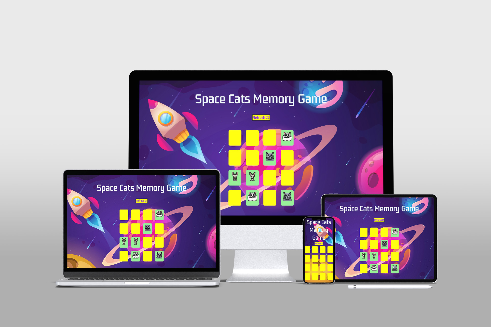
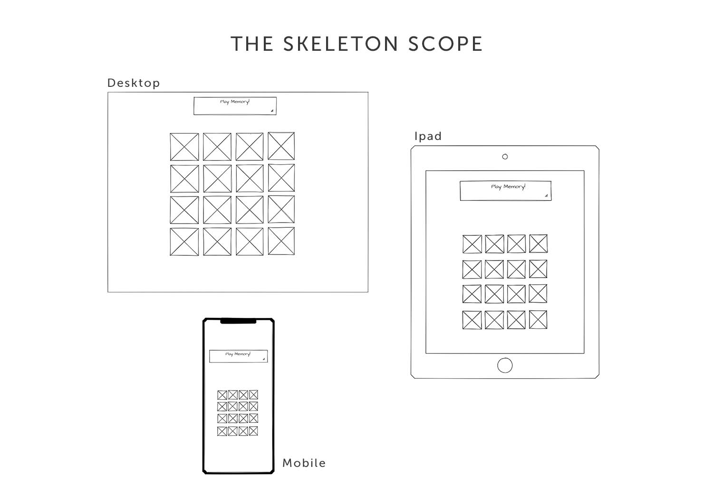
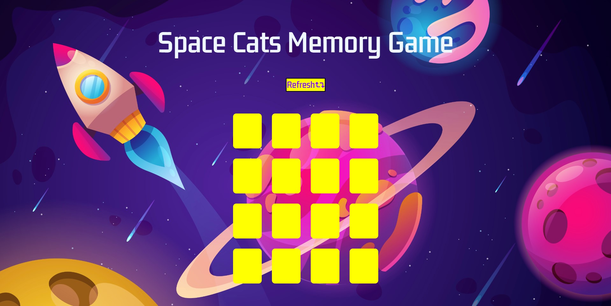
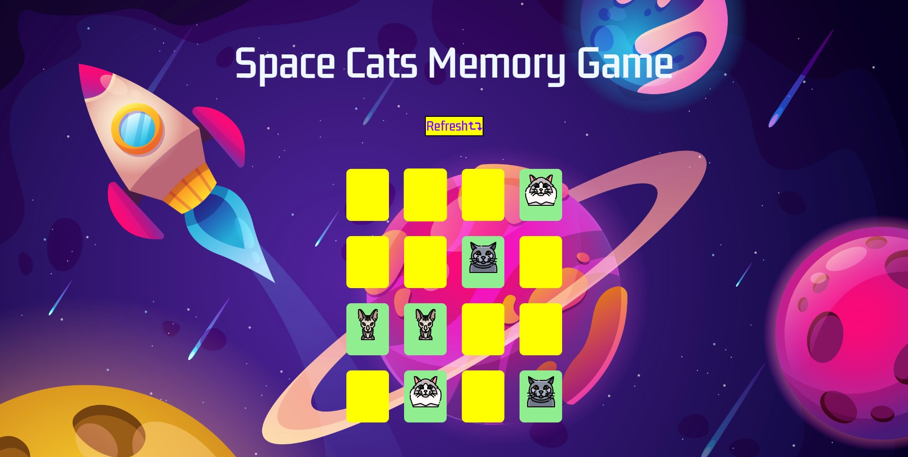
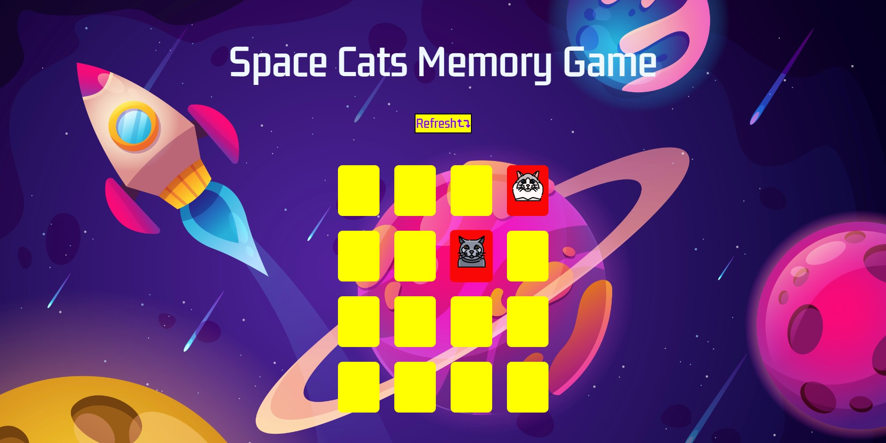
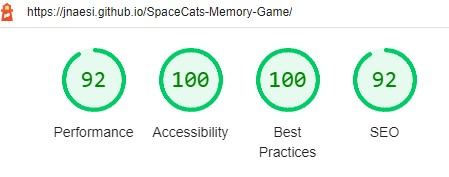

#  Space Cats Memory
## Introduction
Space Cats Memory Game is a web based game built in JavaScript, HTML and CSS.  It is targetted towards users who would like a short fun game to play with a very simple setup.

[View the live website on GitHub Pages](https://jnaesi.github.io/SpaceCats-Memory-Game/)
Please note: To open any links in this document in a new browser tab, please press CTRL + Click.

## Table of Contents
* [Strategy Plane](#Strategy-Plane)
    * [Site Goals](#Site-Goals)
* [The Skeleton Scope](#The-Skeleton-Scope)
    * [Wireframes](#Wireframe)
* [Features](#features)
* [Testing](#testing)
* [Deployment](#deployment)
* [Credits](#credits)
* [Media](#Media)
* [Acknowledgements](#Acknowledgements)

### Strategy Plane
* Space Cats Memory Game is intended to be a fun game for individual users to play for short periods of time. The graphical elements and overall design of games immediately provide the user with a visual indicator of what the site is about and set the tone of the interaction.

#### Site Goals
* To provide users with a fun and simple game to play
* To ensure the game is fully accessible on desktop and touch enabled devices
* To ensure the game is fully compliant with keyboard commands and screen readers

### The Skeleton Scope
#### Wireframe mockups
I used Mockflow to produce wireframes of how the game would look across different devices.

#### Wireframe

# Features
* Common Features
The site is designed with a central column grid layout that the JavaScript inserts the relevant HTML into with the title and site background static on a single main page.

#### Main page

#### Correct Answers 

#### Wrong Answers

#### Refresh Button

## Testing
#### Validator Testing
* HTML
  * No errors were returned when passing through the official W3C Validator.

* CSS
  * No errors were returned when passing through the official W3C CSS Validation Service - Jigsaw. 

* JavaScript

  * No errors were returned when passing through the validator service at JSHint.com.

* Lighthouse 
  * The lighthouse report gave a great score of 92, 100, 100, 92. 
  
  

#### Notable Bugs
There is a bug when where you can double click the cards and it will automatically solve the memory game.

## Deployment

* The site was deployed to GitHub pages. The steps to deploy are as follows:
  * In the GitHub repository, navigate to the settings tab
  * Select the pages link from the setting menu on the left hand side 
  * Under the GitHub Pages from the source section drop-down menu, select the master branch 
  * One the master branch has been selected, the page will be automatically refreshed with a detailed ribbon display to indicate the successful deployment. 
  
The live link can be found here - [Space Cats Memory Game Live Site](https://jnaesi.github.io/SpaceCats-Memory-Game/)

## Credits

### CSS
#### Shadow buttons
* https://www.w3schools.com/css/css3_buttons.asp
####  grid columns
* https://www.w3schools.com/cssref/pr_grid-template-columns.asp
####  hover
* https://www.w3schools.com/csSref/sel_hover.asp
#### shake animation
* https://css-tricks.com/snippets/css/shake-css-keyframe-animation/

### HTML
* 
### JavaScript
* 
 
### Reference Material
The sites below where used as reference point for Javascript.
* https://stackoverflow.com/
* https://www.w3schools.com/

### Wireframe
* MockFlow - https://www.mockflow.com

### Media
The background image and the images of the cats was obtained from https://elements.envato.com/ a stock images site.

### Acknowledgements
I'd like to thank the students and community on slack that helped me through Javascript and the incredible learning materials on code institute.